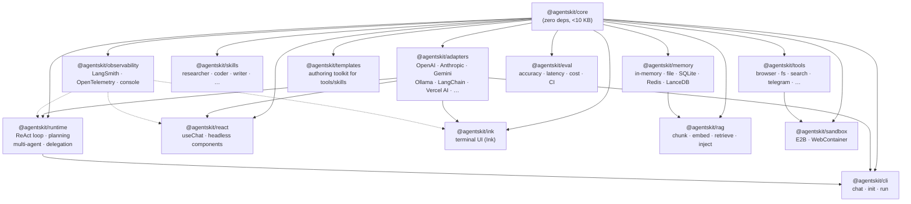
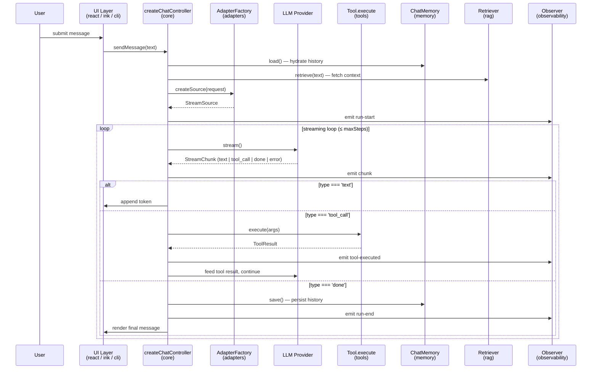

# ARCHITECTURE.md

Technical reference for contributors to AgentsKit.js. Covers founding decisions, package structure, data flow, and extension points. For the _why_ behind individual contracts, see the [ADRs](./docs/architecture/adrs/).

---

## 1. What AgentsKit.js Is (and Is Not)

AgentsKit.js is a **modular agent toolkit**, not a monolith. There is no "AgentsKit app framework" — there are independently installable packages that compose through shared contracts defined in `@agentskit/core`.

Design principles that shape everything here:

- **Core is a promise.** `@agentskit/core` is under 10 KB gzipped with zero runtime dependencies. It holds only types, contracts, and minimal primitives. Once a contract is `stable`, breaking it requires a major version bump and a deprecation cycle.
- **Contract-first, not framework-first.** Every cross-package boundary (Adapter, Tool, Memory, Retriever, Skill, Runtime) is formally specified in an ADR. Packages compose because they agree on types and invariants, not because they share infrastructure.
- **Plug-and-play.** Every package works standalone — single install, under ten lines of config to produce something useful. You pick only what you need.
- **Zero lock-in.** Adapters, memory backends, tools, and skills are all replaceable. No proprietary formats, no hidden state.
- **Agent-first.** Tools, skills, memory, and reasoning loops are primary citizens. UI (React, Ink, CLI) is one rendering surface among many.

See [MANIFESTO.md](./MANIFESTO.md) and [docs/STABILITY.md](./docs/STABILITY.md) for the full stability tier policy.

---

## 2. Package Dependency Graph



Dashed edges represent optional observer injection (no hard compile-time dependency).

---

## 3. Layer Model

```
┌─────────────────────────────────────────────────────────────┐
│  Layer 5: Quality & Ops                                       │
│  @agentskit/observability    @agentskit/eval                  │
├─────────────────────────────────────────────────────────────┤
│  Layer 4: Extensions                                          │
│  @agentskit/tools   @agentskit/skills   @agentskit/memory    │
│  @agentskit/rag     @agentskit/sandbox  @agentskit/templates  │
├─────────────────────────────────────────────────────────────┤
│  Layer 3: UI / Entry Points                                   │
│  @agentskit/react   @agentskit/ink   @agentskit/cli           │
├─────────────────────────────────────────────────────────────┤
│  Layer 2: Runtime + Adapters                                  │
│  @agentskit/runtime          @agentskit/adapters              │
├─────────────────────────────────────────────────────────────┤
│  Layer 1: Foundation                                          │
│  @agentskit/core  (types · contracts · events · primitives)  │
└─────────────────────────────────────────────────────────────┘
```

Rules:
- A package may depend on packages in the same layer or lower layers only.
- Nothing in Layer 1 depends on anything outside Layer 1.
- Layer 3 (UI) does not depend on each other (`react` does not import `ink`, etc.).
- Layer 5 packages are read-only observers — they instrument but do not alter control flow.

---

## 4. Core Design Decisions

### 4.1 Zero-dependency core

`@agentskit/core` has no `dependencies` in `package.json`. It contains:

- TypeScript types for every cross-package primitive (`Message`, `ToolDefinition`, `StreamChunk`, etc.)
- Contract interfaces (`AdapterFactory`, `ChatMemory`, `Retriever`, `SkillDefinition`, `RuntimeConfig`)
- `createChatController` — the minimal orchestration primitive used by both `@agentskit/react` and `@agentskit/ink`
- A tiny event emitter (no Node.js `EventEmitter` dependency)

This means `@agentskit/core` can be imported in any environment (browser, edge, Node, Deno, Bun) without bundler shims.

### 4.2 Contract-first design

Every cross-package boundary is defined as a TypeScript interface with formal invariants, versioned in an ADR. The contracts are:

| Contract | ADR | Key invariant |
|---|---|---|
| Adapter | [ADR 0001](./docs/architecture/adrs/0001-adapter-contract.md) | Pure factory; errors as chunks; explicit terminal chunk |
| Tool | [ADR 0002](./docs/architecture/adrs/0002-tool-contract.md) | JSON Schema input; typed `execute` output; confirmation flag |
| Memory | [ADR 0003](./docs/architecture/adrs/0003-memory-contract.md) | Atomic load/save; pluggable backend |
| Retriever | [ADR 0004](./docs/architecture/adrs/0004-retriever-contract.md) | `retrieve(query) → Document[]`; pluggable store |
| Skill | [ADR 0005](./docs/architecture/adrs/0005-skill-contract.md) | System prompt + few-shot + tool contributions |
| Runtime | [ADR 0006](./docs/architecture/adrs/0006-runtime-contract.md) | `run(task) → RunResult`; hard step cap; observer-only side effects |

### 4.3 Plug-and-play via contracts

Because every boundary is a contract (not a base class or a required superclass), packages compose without glue code. `useChat` in `@agentskit/react` accepts any `AdapterFactory`. The runtime accepts any `ChatMemory`. There is no "AgentsKit adapter base class" to inherit — satisfy the interface, ship.

### 4.4 Headless UI

React and Ink components use `data-ak-*` attributes for all structural hooks. No hardcoded styles. CSS variables for theming. This lets any design system own visual output while AgentsKit owns behavior.

### 4.5 Stability tiers

Packages declare a stability tier (`stable`, `beta`, `experimental`) in `package.json`. See [docs/STABILITY.md](./docs/STABILITY.md) for the full policy. Currently all Layer 1–4 packages are `stable`; `@agentskit/observability`, `@agentskit/sandbox`, and `@agentskit/eval` are `beta`.

---

## 5. Data Flow

How a message travels from user input to assistant response, end to end.



Key properties of this flow:

- **Streaming is the default.** Text tokens are forwarded to the UI immediately — there is no buffering-until-done.
- **Tool calls are synchronous from the loop's perspective.** The loop awaits `execute`, feeds the result back to the model, and continues. Parallel tool calling (multiple `tool_call` chunks in one turn) is resolved before continuing the loop.
- **Memory is read-then-write.** History is loaded once before the run; saved once after a successful completion. Aborted or failed runs do not save (Memory invariant CM4).
- **RAG retrieval is per-run, not per-step.** The original user query is used once to retrieve context, injected into the system prompt or as a context message.
- **Observers are read-only.** They receive every event but cannot mutate messages, tool calls, or results. Observer failures are caught and logged — they do not abort the run.

---

## 6. Extension Points

### 6.1 New LLM provider (Adapter)

Implement `AdapterFactory` from `@agentskit/core`:

```ts
import { createAdapter } from '@agentskit/adapters'

export const myAdapter = createAdapter(async function* (request) {
  // call your provider, yield StreamChunk objects
  yield { type: 'text', content: '...' }
  yield { type: 'done' }
})
```

Must satisfy all 10 invariants in [ADR 0001](./docs/architecture/adrs/0001-adapter-contract.md). A `AdapterContractSuite` (forthcoming) will mechanically validate conformance.

### 6.2 New tool

Implement `ToolDefinition` from `@agentskit/core`:

```ts
import type { ToolDefinition } from '@agentskit/core'

export const myTool: ToolDefinition = {
  name: 'my_tool',
  description: 'What it does',
  schema: { type: 'object', properties: { query: { type: 'string' } }, required: ['query'] },
  execute: async ({ query }) => ({ result: `processed: ${query}` }),
}
```

Register by passing to `useChat({ tools: [myTool] })`, `createRuntime({ tools: [myTool] })`, or in a skill's `onActivate`.

### 6.3 New memory backend

Implement `ChatMemory` from `@agentskit/core`:

```ts
import type { ChatMemory } from '@agentskit/core'

export const myMemory: ChatMemory = {
  async load() { /* return Message[] */ },
  async save(messages) { /* persist */ },
  async clear() { /* wipe */ },
}
```

Pass to any runtime, hook, or controller via the `memory` config field. See [ADR 0003](./docs/architecture/adrs/0003-memory-contract.md).

### 6.4 New skill

Implement `SkillDefinition` from `@agentskit/core`:

```ts
import type { SkillDefinition } from '@agentskit/core'

export const mySkill: SkillDefinition = {
  name: 'my_skill',
  description: 'What this skill makes the agent do',
  systemPrompt: 'You are a ...',
  examples: [],                     // few-shot turns
  onActivate: (ctx) => ({           // optional: contribute tools when active
    tools: [myTool],
  }),
}
```

See [ADR 0005](./docs/architecture/adrs/0005-skill-contract.md).

### 6.5 New retriever (RAG backend)

Implement `Retriever` from `@agentskit/core`:

```ts
import type { Retriever } from '@agentskit/core'

export const myRetriever: Retriever = {
  async retrieve(query) {
    // return Document[]
  },
}
```

See [ADR 0004](./docs/architecture/adrs/0004-retriever-contract.md). Use with `createRuntime({ retriever: myRetriever })` or `useRAGChat({ retriever: myRetriever })`.

### 6.6 New observability integration

Implement the `Observer` interface and pass it to the runtime:

```ts
createRuntime({
  adapter,
  observers: [myObserver],
})
```

Observers receive typed events for every significant action (run start/end, chunk, tool call, delegation). They are read-only and their failures are silently caught.

---

## 7. ADR Index

| ADR | Decision | Status |
|---|---|---|
| [0001](./docs/architecture/adrs/0001-adapter-contract.md) | Adapter contract v1 | Accepted |
| [0002](./docs/architecture/adrs/0002-tool-contract.md) | Tool contract v1 | Accepted |
| [0003](./docs/architecture/adrs/0003-memory-contract.md) | Memory contract v1 | Accepted |
| [0004](./docs/architecture/adrs/0004-retriever-contract.md) | Retriever contract v1 | Accepted |
| [0005](./docs/architecture/adrs/0005-skill-contract.md) | Skill contract v1 | Accepted |
| [0006](./docs/architecture/adrs/0006-runtime-contract.md) | Runtime contract v1 | Accepted |
| [0007](./docs/architecture/adrs/0007-docs-platform-fumadocs.md) | Documentation platform: Fumadocs | Accepted |

New ADRs go in `docs/architecture/adrs/`. See [`docs/architecture/adrs/README.md`](./docs/architecture/adrs/README.md) for format and when to write one.

---

## 8. Code Conventions (Quick Reference)

| Concern | Rule |
|---|---|
| TypeScript | Strict mode. No `any` — use `unknown` and narrow. |
| Exports | Named exports only. No default exports. |
| UI | Headless. `data-ak-*` attributes. CSS variables for theming. |
| Build | tsup, dual CJS/ESM output per package. |
| Tests | vitest. Test external contracts, not implementation details. |
| Versioning | Changesets (`pnpm changeset`). Stable contracts follow ADR semver rules. |
| Bundle size | `@agentskit/core` must stay under 10 KB gzipped. CI enforces. |

---

*This document is the canonical architectural reference. Changes that affect foundational decisions should be accompanied by a new or updated ADR. Changes to this document alone are not sufficient for contract changes.*
