<div align="center">

# AgentsKit.js

**The agent toolkit JavaScript actually deserves.**

A 10KB core. Twelve plug-and-play packages. Zero lock-in. Six formal contracts that make every adapter, tool, skill, memory, retriever, and runtime substitutable.

[](https://www.npmjs.com/package/@agentskit/react)
[](https://bundlephobia.com/package/@agentskit/react)
[](./LICENSE)
[](https://discord.gg/zx6z2p4jVb)
[](https://github.com/AgentsKit-io/agentskit)
[](https://github.com/AgentsKit-io/agentskit/issues)
[](https://github.com/AgentsKit-io/agentskit/pulls)
[](https://github.com/AgentsKit-io/agentskit/commits)
[](https://www.npmjs.com/package/@agentskit/core)

[**Documentation**](https://www.agentskit.io) · [**Discord**](https://discord.gg/zx6z2p4jVb) · [**Manifesto**](./MANIFESTO.md) · [**Origin**](./ORIGIN.md) · [**Architecture**](./docs/architecture/adrs)

<a href="https://www.producthunt.com/products/agentskit?embed=true&utm_source=badge-featured&utm_medium=badge&utm_campaign=badge-agentskit" target="_blank" rel="noopener noreferrer"></a>

</div>

---

*You started building an AI agent last week. You're three libraries deep, two of them fight each other, and nothing you wrote is reusable. This is for you.*

## Why this exists

**We don't need another framework. We need a kit.**

Building a real AI agent in JavaScript today means cobbling together five libraries that don't fit. Vercel AI SDK is a beautiful chat SDK with no runtime. LangChain.js drags in 200MB and leaks abstractions at every layer. MCP solves tool interop and nothing else. assistant-ui has 53 components and no opinion about how to compose them.

AgentsKit is the missing kit: small, contracted, composable. Six packages you can use alone, twelve that combine without ceremony. You stay in plain JavaScript the entire time.

> [Origin story](./ORIGIN.md) for the long version. [Manifesto](./MANIFESTO.md) for the principles.

---

## Quick start — chat in 10 lines

```bash
npm install @agentskit/react @agentskit/adapters
```

```tsx
import { useChat, ChatContainer, Message, InputBar } from '@agentskit/react'
import { anthropic } from '@agentskit/adapters'
import '@agentskit/react/theme'

export default function Chat() {
  const chat = useChat({ adapter: anthropic({ apiKey: KEY, model: 'claude-sonnet-4-6' }) })
  return (
    <ChatContainer>
      {chat.messages.map(m => <Message key={m.id} message={m} />)}
      <InputBar chat={chat} />
    </ChatContainer>
  )
}
```

Streaming, tool calls, default styling, abortable. No setup. No boilerplate.

---

## Before and after

**Before** — the typical "JS agent" stack:

```ts
// Pick your favorite: LangChain, raw fetch, Vercel AI SDK + custom runtime,
// MCP client + custom UI, manual ReAct loop, hand-rolled streaming...
// Then wire memory. Then wire tools. Then wire delegation. Then debug.
```

**After** — AgentsKit:

```ts
import { createRuntime } from '@agentskit/runtime'
import { openai } from '@agentskit/adapters'
import { webSearch, filesystem } from '@agentskit/tools'

const runtime = createRuntime({
  adapter: openai({ apiKey: KEY, model: 'gpt-4o' }),
  tools: [webSearch(), ...filesystem({ basePath: './workspace' })],
})

const result = await runtime.run('Research the top 3 AI frameworks and save a summary')
```

That's an autonomous agent. With a tool registry. With memory. With observability hooks. Two imports, six lines.

Swap providers in **one** line — every other line stays the same:

```ts
import { anthropic, openai, gemini, ollama, deepseek, grok } from '@agentskit/adapters'

useChat({ adapter: anthropic({ apiKey, model: 'claude-sonnet-4-6' }) })
useChat({ adapter: openai({ apiKey, model: 'gpt-4o' }) })
useChat({ adapter: ollama({ model: 'llama3.1' }) })          // local, no key
```

---

## How AgentsKit compares

| | AgentsKit | Vercel AI SDK | LangChain.js | assistant-ui |
|---|---|---|---|---|
| **Core size** | 10KB gzip, zero deps | ~30KB | hundreds of MB transitively | n/a (UI only) |
| **Agent runtime** | First-class (ReAct, tools, skills, delegation, memory, RAG) | None | Yes, but heavy | None |
| **Provider swap** | One line | Route-handler-shaped | Per-class wiring | BYO backend |
| **UI surfaces** | React + Ink + headless | React | None | React |
| **Formal contracts** | Six versioned ADRs | Implicit | Implicit | Implicit |
| **Edge-ready** | Yes (10KB core, no Node-only deps) | Mostly | No | n/a |

### When you should NOT use AgentsKit

We are honest about this:

- **You only need a single OpenAI streaming call.** Use the `openai` SDK directly — AgentsKit is overkill.
- **You're shipping a chat SDK to consumers, not an agent.** Vercel AI SDK is purpose-built for that and excellent.
- **You need Python.** AgentsKit is JavaScript-first by design. Use a Python framework.
- **You require enterprise-grade observability today.** AgentsKit's observability layer is good but young; LangSmith/Arize/Helicone are more mature integrations right now.
- **You can't accept a v0.x semver story.** We're pre-1.0 with formal contracts already locked, but real production teams may want a stable v1.0.0 first.

---

## The ecosystem

Pick what you need. Every package works alone. Combinations work without glue code.

| Package | What it does | Stability |
|---|---|---|
| [`@agentskit/core`](packages/core) | Types, contracts, primitives | stable |
| [`@agentskit/adapters`](packages/adapters) | Provider adapters (OpenAI, Anthropic, Gemini, Ollama, DeepSeek, Grok, …) | stable |
| [`@agentskit/react`](packages/react) | React hooks + headless UI | stable |
| [`@agentskit/ink`](packages/ink) | Terminal UI (Ink) components | stable |
| [`@agentskit/cli`](packages/cli) | CLI: chat, init, run | stable |
| [`@agentskit/runtime`](packages/runtime) | Autonomous agent runtime (ReAct loop, delegation) | stable |
| [`@agentskit/tools`](packages/tools) | Web search, filesystem, shell | stable |
| [`@agentskit/skills`](packages/skills) | Pre-built behavioral prompts | stable |
| [`@agentskit/memory`](packages/memory) | Chat + vector memory (SQLite, Redis, file) | stable |
| [`@agentskit/rag`](packages/rag) | Plug-and-play RAG | stable |
| [`@agentskit/observability`](packages/observability) | Console, LangSmith, OpenTelemetry | beta |
| [`@agentskit/sandbox`](packages/sandbox) | Secure code execution | beta |
| [`@agentskit/eval`](packages/eval) | Agent evaluation and benchmarking | beta |
| [`@agentskit/templates`](packages/templates) | Authoring toolkit for skills/tools | stable |

The whole catalog is one `npx @agentskit/cli init` away.

---

## Multi-agent delegation

```ts
import { planner, researcher, coder } from '@agentskit/skills'

const result = await runtime.run('Build a landing page about quantum computing', {
  skill: planner,
  delegates: {
    researcher: { skill: researcher, tools: [webSearch()], maxSteps: 3 },
    coder:      { skill: coder, tools: [...filesystem({ basePath: './src' })], maxSteps: 8 },
  },
})
```

The planner decomposes the task. The researcher and coder execute their parts. Delegation happens through a tool the model already knows how to call — no special syntax to learn.

---

## Terminal chat (Ink)

```bash
npm install -g @agentskit/cli
agentskit chat --provider ollama --model llama3.1
agentskit chat --provider openai --tools web_search,shell --skill researcher
```

The same `useChat` mental model. Real keyboard input. Real streaming. Real tools.

---

## For AI agents reading this

The full public API fits in **under 2,000 tokens**. Paste the [agent-friendly reference](https://www.agentskit.io/docs/getting-started/for-ai-agents) into your LLM context and start generating real AgentsKit code immediately. We treat agents as first-class consumers of our docs.

---

## Package dependency graph

```mermaid
graph TD
    core["@agentskit/core\n(zero deps · 5 KB)"]

    adapters["@agentskit/adapters\nOpenAI · Anthropic · Gemini\nOllama · DeepSeek · Grok"]
    react["@agentskit/react\nReact hooks + headless UI"]
    ink["@agentskit/ink\nTerminal UI (Ink)"]
    runtime["@agentskit/runtime\nReAct loop · delegation"]
    tools["@agentskit/tools\nweb search · filesystem · shell"]
    skills["@agentskit/skills\nresearcher · coder · planner"]
    memory["@agentskit/memory\nSQLite · Redis · file · vector"]
    rag["@agentskit/rag\nplug-and-play RAG"]
    observability["@agentskit/observability\nLangSmith · OpenTelemetry"]
    sandbox["@agentskit/sandbox\nE2B · WebContainer"]
    eval["@agentskit/eval\nbenchmarking · metrics"]
    templates["@agentskit/templates\nskill/tool authoring"]
    cli["@agentskit/cli\nchat · init · run"]

    core --> adapters
    core --> react
    core --> ink
    core --> runtime
    core --> tools
    core --> skills
    core --> memory
    core --> rag
    core --> observability
    core --> sandbox
    core --> eval
    core --> templates

    cli --> core
    cli --> adapters
    cli --> ink
    cli --> runtime
    cli --> skills
    cli --> tools
    cli --> memory

    classDef foundation fill:#1e293b,stroke:#6366f1,color:#f8fafc,font-weight:bold
    classDef ui        fill:#0f172a,stroke:#22d3ee,color:#f8fafc
    classDef agent     fill:#0f172a,stroke:#a78bfa,color:#f8fafc
    classDef data      fill:#0f172a,stroke:#34d399,color:#f8fafc
    classDef ops       fill:#0f172a,stroke:#fb923c,color:#f8fafc
    classDef entry     fill:#0f172a,stroke:#f472b6,color:#f8fafc

    class core foundation
    class react,ink ui
    class adapters,runtime,tools,skills agent
    class memory,rag,templates data
    class observability,sandbox,eval ops
    class cli entry
```



**Legend:** purple = provider/execution layer · cyan = UI layer · green = data layer · orange = ops layer · pink = CLI entry point

---

## Architecture and contracts

Six ADRs define the substrate:

| ADR | Contract |
|---|---|
| [0001](./docs/architecture/adrs/0001-adapter-contract.md) | Adapter — LLM provider seam |
| [0002](./docs/architecture/adrs/0002-tool-contract.md) | Tool — function the model calls |
| [0003](./docs/architecture/adrs/0003-memory-contract.md) | Memory — chat history + vector store + embed |
| [0004](./docs/architecture/adrs/0004-retriever-contract.md) | Retriever — context fetching |
| [0005](./docs/architecture/adrs/0005-skill-contract.md) | Skill — declarative persona |
| [0006](./docs/architecture/adrs/0006-runtime-contract.md) | Runtime — the loop that composes them all |

Read these once and you can predict how every package behaves.

---

## Status

`@agentskit/core` is at **v1.0.0** — API frozen at the minor level, deprecations carry a cycle, contracts pinned to ADRs. Other packages track their own cadence and individual [stability tiers](./docs/STABILITY.md).

Concretely, as of the Phase 1 release:

- **538 tests** across 14 packages
- **5.17 KB** gzipped core — 48% under the 10 KB manifesto budget (enforced in CI)
- **Seven formal contracts** pinned to ADRs 0001–0007
- **74 documentation routes** including 13 copy-paste recipes and 3 migration guides

See the [Phase 1 release notes](./docs/RELEASE-CORE-V1.md) for what shipped, and the [Master PRD](https://github.com/AgentsKit-io/agentskit/issues/113) for what's next.

---

## Contributing

AgentsKit is built in the open and ships because contributors show up. Every package, every doc, every example is fair game.

- **[How to contribute →](https://www.agentskit.io/docs/contribute)** — start here
- **[Good-first-issues](https://github.com/AgentsKit-io/agentskit/issues?q=is%3Aissue+is%3Aopen+label%3A%22good+first+issue%22)** — curated, tractable tickets
- **[Help-wanted](https://github.com/AgentsKit-io/agentskit/issues?q=is%3Aissue+is%3Aopen+label%3A%22help+wanted%22)** — larger scoped work
- **[Discussions](https://github.com/AgentsKit-io/agentskit/discussions)** — ask, propose, share
- **[RFC template](https://github.com/AgentsKit-io/agentskit/issues/new?template=rfc.yml)** — open before touching a contract
- **[`CONTRIBUTING.md`](./CONTRIBUTING.md)** — dev setup + PR checklist

### Contributors

<a href="https://github.com/AgentsKit-io/agentskit/graphs/contributors">
  
</a>

Thanks to everyone who's shipped a line of code, docs, or feedback.

---

## License

MIT — see [`LICENSE`](./LICENSE).
