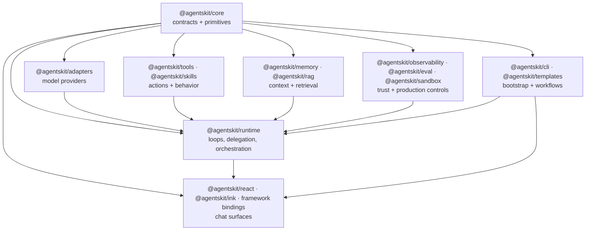

AgentsKit works best when you think of it as a layered ecosystem, not a single framework.

At the center is a small contract layer. Around it are packages for UI, runtime, data, and production. You can start with one layer and add the rest as your agent becomes more capable.

## The stack in one view

## What each layer does

| Layer | Packages | Role |
|---|---|---|
| Contract layer | `@agentskit/core` | Shared types, controller, events, and contracts |
| UI layer | `@agentskit/react`, `@agentskit/ink`, framework bindings | Chat surfaces and framework-specific ergonomics |
| Provider layer | `@agentskit/adapters` | Model vendors, routing, fallbacks, local models |
| Runtime layer | `@agentskit/runtime` | Multi-step execution, delegation, orchestration |
| Capability layer | `@agentskit/tools`, `@agentskit/skills` | Tool use, integrations, behavior packaging |
| Data layer | `@agentskit/memory`, `@agentskit/rag` | Persistence, retrieval, embeddings, reranking |
| Production layer | `@agentskit/observability`, `@agentskit/eval`, `@agentskit/sandbox` | Tracing, quality control, safety |
| Bootstrap layer | `@agentskit/cli`, `@agentskit/templates` | Project setup, workflows, scaffolding |

## The six contracts

The reason the ecosystem composes is that the layers meet through six stable contracts:

- `Adapter` — swap model providers
- `Tool` — expose actions to the model
- `Skill` — package behavior and prompts
- `Memory` — persist and reload context
- `Retriever` — fetch external context
- `Runtime` — compose the loop that ties everything together

Deep dive: [Concepts](/docs/get-started/concepts)

## Three common adoption paths

### 1. UI first

Start with `@agentskit/react` or `@agentskit/ink`, then add runtime and tools once the chat needs to do real work.

Best for:
- chat products
- prototypes
- customer-facing assistants

### 2. Runtime first

Start with `@agentskit/runtime` and `@agentskit/tools`, then add a UI later if the workflow proves useful.

Best for:
- jobs
- internal automations
- research agents
- coding agents

### 3. Knowledge first

Start with `@agentskit/rag`, `@agentskit/memory`, and a UI or runtime entry point, then harden with production controls.

Best for:
- internal copilots
- support assistants
- retrieval-heavy apps

## How teams usually grow the stack

1. Pick a provider and a single entry point.
2. Add runtime when the task becomes multi-step.
3. Add tools when the model needs to act.
4. Add memory and retrieval when context needs to persist.
5. Add observability, evals, and safety before wider rollout.

## Where to go next

- [Build your first agent](/docs/get-started/getting-started/build-your-first-agent)
- [Use cases](/docs/use-cases)
- [Packages overview](/docs/reference/packages/overview)
- [agentskit init](/docs/production/cli/init)
